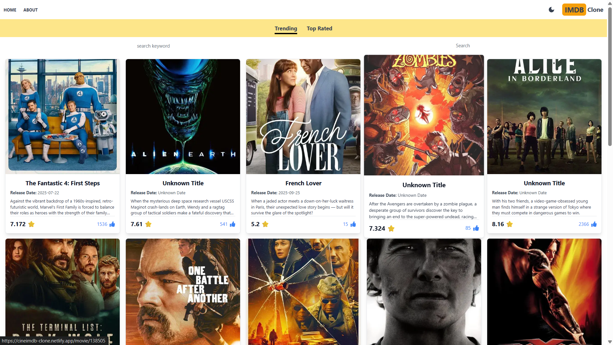
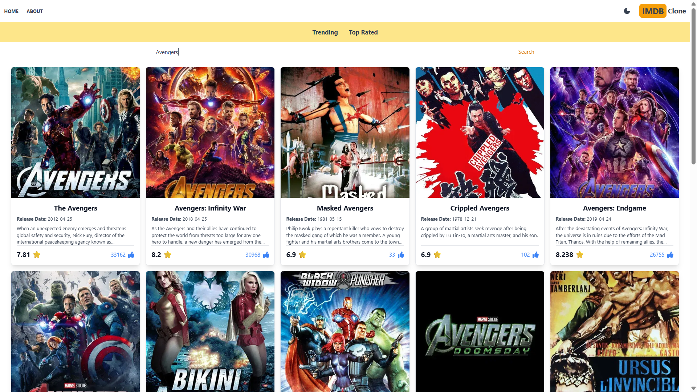
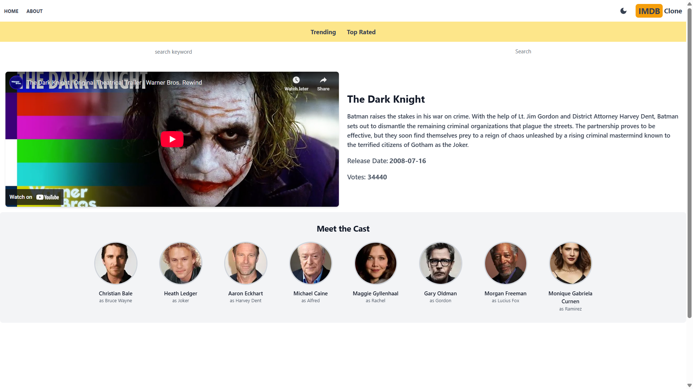

# 🎬 IMDb Clone  

An **interactive and feature-rich IMDb Clone** built with **Next.js** ⚡ and styled using **Tailwind CSS** 🎨.  
This app allows users to **search for movies, explore categories, watch trailers, and view cast details** – all powered by the **TMDB API** 🎥.  

🔗 **Live Demo**: [cineimdb-clone.netlify.app](http://cineimdb-clone.netlify.app/)  

---

## ✨ Features  

- 🔍 **Movie Search** – Search movies instantly using the TMDB API.  
- 🎭 **Categories & Genres** – Explore movies across multiple categories and genres.  
- 📖 **Detailed Movie Page** – Get posters, overview, ratings, likes, and release dates.  
- 🎬 **YouTube Trailer Integration** – Watch official trailers directly inside the app.  
- 👥 **Cast Information** – Discover actors and crew details for each movie.  
- 📱 **Responsive UI** – Smooth and modern design powered by Tailwind CSS.  
- ⚡ **Next.js API Routes** – Optimized server-side rendering and API handling.  

---
## 🖥️ Demo Screenshots

**1️⃣ Home Page**  


**2️⃣ Search Result**  


**3️⃣ Movie Details(with Trailer and Cast)**  


---
## 🛠️ Tech Stack  

- ⚡ **Next.js** – Server-side rendering, routing & API integration.  
- 🎨 **Tailwind CSS** – Modern utility-first CSS framework.  
- 🎥 **TMDB API** – Real-time movie & TV show data.  
- ▶️ **YouTube Embed** – Play trailers directly in the app.  

---

## 🚀 Installation & Usage  

1. Clone the repository:
   ```bash
   git clone https://github.com/yourusername/imdb-clone.git
   ```
2. Navigate to the project directory:
   ```bash
   cd imdb-clone
   ```
3. Install dependencies:
   ```bash
   npm install
   ```
4. Create a `.env.local` file and add your TMDB API key:
   ```env
   NEXT_PUBLIC_TMDB_API_KEY=your_api_key_here
   ```
5. Run the development server:
   ```bash
   npm run dev
   ```
6. Open (http://cineimdb-clone.netlify.app/) to view the app.

## Deployment

This project can be deployed on **Vercel** or any Next.js-supported platform:
```bash
npm run build
npm start
```
## 👤 Author & Connect With Me

<div align="center">

### **Yashwant Bhole**

<p align="center">  
  <a href="https://www.linkedin.com/in/yashwantbhole/" target="_blank">
    
  </a>
  <a href="mailto:yashwantbhole2004@gmail.com">
    
  </a>
  <a href="https://github.com/YashwantBhole" target="_blank">
    
  </a>
</p>

💼 *Full Stack Developer — MERN • Java • Spring Boot*  
🌟 *Building AI-powered systems with clean architecture and strong UI/UX.*

</div>

---

## ⭐ Feedback

If you found this project helpful, please ⭐ **star** the repository — it encourages me a lot! 
